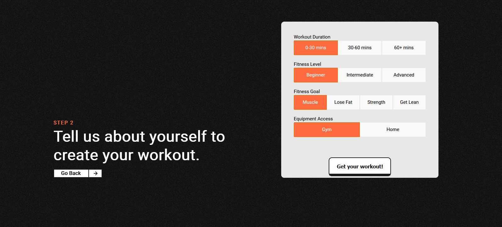

## FLEX - custom workout generator

FLEX

A Flask based application designed to generate customized workout plans for users based on their specified parameters.
If no existing workout aligns with the user's preferences, the application can create a workout plan using the OpenAI API.


## Project Architcture


## Installation and Setup Instructions

1. Ensure you have Docker and Docker Compose installed on your system. 

2. Clone this repository.
   
  `git clone https://github.com/yishaigalili/Flex.git`

3. Navigate to the repository on your computer

4. Create .env file

  `touch app/.env`
  ```
  echo "POSTGRES_USER=postgres
  POSTGRES_PASSWORD=postgres
  POSTGRES_HOST=localhost
  POSTGRES_DB=flex
  GMAIL_USERNAME= # optional for sending mails
  GMAIL_PASSWORD= # optional for sending mails
  OPENAI_API_KEY= # optional for generating workouts using openai API
  APP_SECRET_KEY=key" > app/.env
```


5. Run the following command to start the application:

`docker-compose up`  

6. Visit the App:

`localhost:5000`

## Contributing

Contributions are welcome! Please feel free to submit pull requests or open issues for any improvements or bug fixes.


## License

[MIT](https://choosealicense.com/licenses/mit/)


## Screenshots





